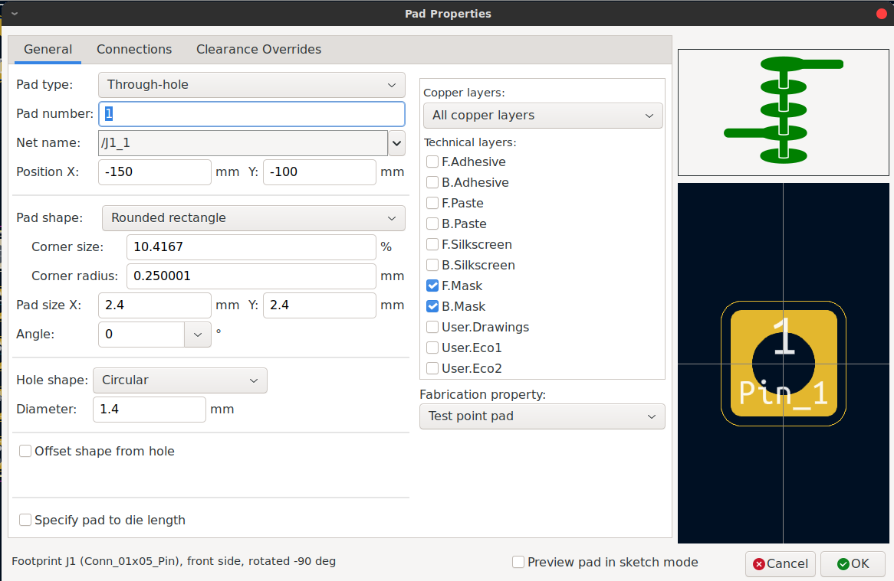
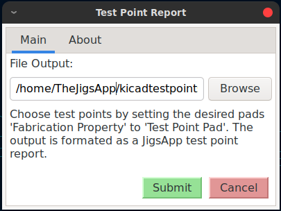

# KiCAD Test Points
This plugin generates a JigApp compatible test point report for generating bed-of-nails
testers.

This plugin is similar to the command line tool [kicad-testpoints](https://github.com/TheJigsApp/kicad-testpoints) except it can be used entirely within the KiCAD user interface (no terminals required).

## Use
Any pad can be set as a test point. 
Select the pad and edit it's properties. 
Set the 'Fabrication property' drop-down to 'Test point pad'.

Run the plugin, select the output file and confirm.

The plugin pulls creates the report as a csv.

## Links
+ [Blog Post](https://www.thejigsapp.com/blog/2024/06/03/kicad-testpoints-plugin/)
+ [Video Introduction](https://www.youtube.com/watch?v=Z7aEWe4d0jE)

## Acknowledgements
+ KiCAD PCM Packaging: Fully based off of (https://github.com/sparkfun/SparkFun_KiCad_Panelizer).
